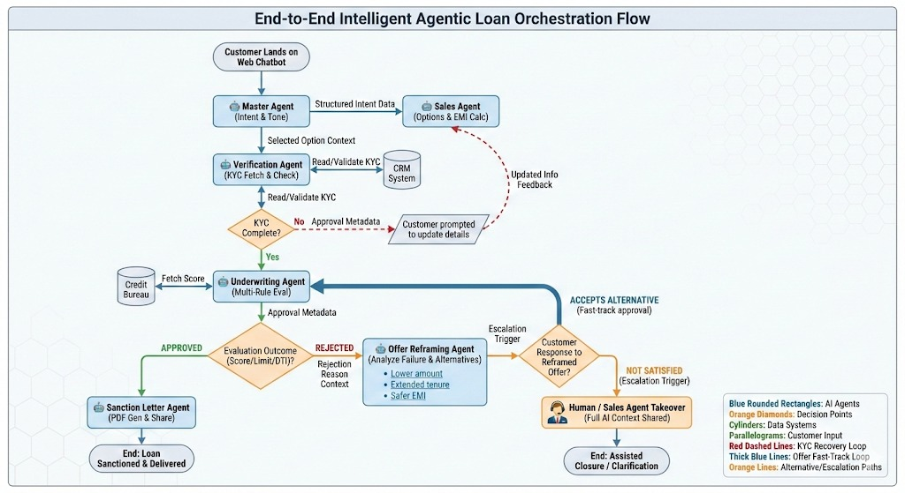

# FinSentinent 🏦  
### Agentic AI System for Intelligent Personal Loan Processing in BFSI

FinSentinent is an agentic AI system designed to transform digital personal loan journeys for NBFCs by combining autonomous agent orchestration, explainable decisioning, emotion-aware engagement, and compliance-first execution.

The system simulates a human loan officer at digital scale while remaining auditable, controllable, and production-aligned.

---

## 🚀 Core Value Proposition

- Agentic orchestration instead of linear chatbot flows
- Emotion and intent aware conversational reasoning
- Policy driven underwriting with full explainability
- Rejection is treated as a recoverable state, not a dead end
- Seamless transition from AI to human without loss of context
- Designed for BFSI compliance, trust, and scale

---

## 🧠 Agentic Architecture

### Agent Roles

- **Master Agent**  
  Owns the conversation, memory, orchestration, and control flow

- **Sales Agent**  
  Understands need, explains EMI, persuades with transparency

- **Verification Agent**  
  Performs KYC validation using CRM data

- **Underwriting Agent**  
  Applies credit policy, salary rules, EMI thresholds

- **Offer Reframing Agent**  
  Converts rejection into safer alternatives using reason-aware logic

- **Sanction Agent**  
  Generates sanction letter upon approval

---

## 🧩 System Architecture Diagram

---

## 🔄 End-to-End Flow

---

## 🧠 Memory and Intelligence Layer

- Conversational memory across sessions
- Emotional state and intent tracking
- Shared context across all agents
- Feedback loops for recovery and escalation
- Full decision trace for audit and compliance

---

## 📊 Demonstrated Scenarios

### Case 6: Credit Eligible with Salary Validation  

### Case 10: Rejection with Intelligent Reframing  

### Case 11: Approval with Instant Sanction  

---

## 🛠️ Technology Stack (Production Vision)

### Agentic and Intelligence Layer
- CrewAI
- LangGraph
- Pluggable LLMs (OpenAI, Azure OpenAI, Gemini)
- Prompt and Policy Guardrails

### Backend and APIs
- FastAPI
- Python
- Event driven microservices

### Data and Memory
- Vector databases (Chroma, FAISS)
- Relational databases (PostgreSQL)
- Object storage for documents

### Security and Compliance
- RBI aligned policy enforcement
- Role based access control
- Audit logs and traceability
- Human in the loop escalation

### Deployment
- Docker
- Kubernetes
- Cloud native infrastructure
- CI CD pipelines

---

## 🔐 Design Principles

- No black box decisions
- Every approval and rejection is explainable
- AI autonomy with controlled escalation
- Recovery focused customer journeys
- Production aligned interfaces

---

## 📌 Note

This repository focuses on **agent orchestration, intelligence flow, and system design**.  
UI and infrastructure components are abstracted to highlight decision intelligence and agent collaboration.

---

## 📎 Assets

- Architecture Diagram: `assets/architecture.png`
- Flowchart: `assets/flowchart.jpeg`
- Case Demonstrations: `assets/cases/`
